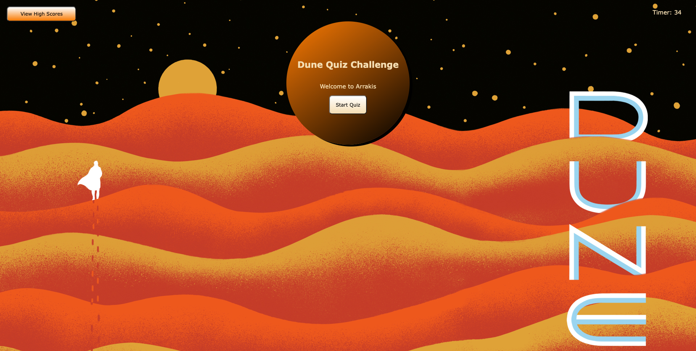

# dune-code-quiz
## Description
My goal for this project was to create a five question quiz on the novel, Dune, by Frank Herbert. Th user should be able to start the game and answer the series of questions. The screen will display if the answer is right or wrong and if it is wrong, then the time will subtract by 10 seconds. Then the user is prompted to put in their initials and their score is recorded in their local storage, then printed on the view high score screen. This project was created so I could learn how to use DOM manipulators and traversal. The main problem I solved was how to hide and show each screen when the user clicked on a certain button and how to save an array of objects into local storage. During this project, I learned how to use DOM manipulators and traversal, set/get local storage and create a time interval.
## Installation
[Link to Quiz](https://tinastanczyk.github.io/dune-code-quiz/)
## Usage

## Credits
Not Applicable
## License
[Link to License](LICENSE)